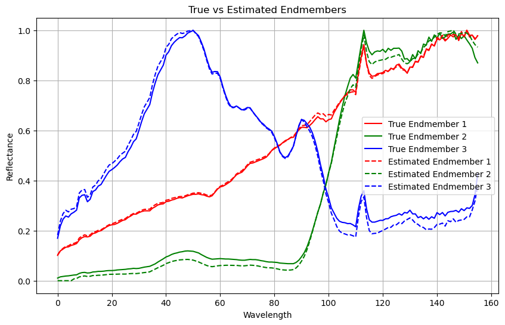
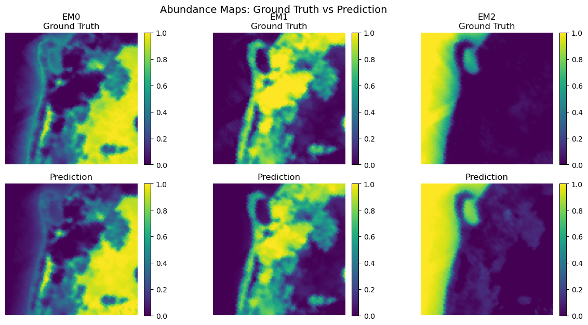

# 🛰️ Beta-VAE for Hyperspectral Unmixing

A **deep learning framework** for hyperspectral unmixing using **Variational Autoencoders** with **Dirichlet latent distributions**, achieving **state-of-the-art performance** on benchmark datasets.

---

## 📘 Overview

Hyperspectral unmixing decomposes each pixel spectrum into **pure material spectra (endmembers)** and their **fractional abundances**.  
This work introduces a **Beta-VAE** architecture leveraging the **Dirichlet distribution**’s natural **simplex constraint** to model abundance maps **probabilistically and physically consistently**.

---

## 🌈 Hyperspectral Unmixing Problem

### Linear Mixing Model

We assume a **linear mixture** of $M$ endmembers across $N$ pixels and $L$ spectral bands:

$$
\mathbf{Y} = \mathbf{E}\mathbf{A} + \mathbf{N}
$$

where:

- $\mathbf{Y} \in \mathbb{R}^{L\times N}$ — observed hyperspectral data  
- $\mathbf{E} \in \mathbb{R}^{L\times M}$ — endmember matrix  
- $\mathbf{A} \in \mathbb{R}^{M\times N}$ — abundance matrix  
- $\mathbf{N} \in \mathbb{R}^{L\times N}$ — additive noise  

### Constraints

Each pixel’s abundances must satisfy:

$$
a_{m,n} \ge 0 \quad \forall m,n
$$

$$
\sum_{m=1}^{M} a_{m,n} = 1 \quad \forall n
$$

so that $\mathbf{A}$ lies on a **unit simplex**.

---

##  State-of-the-Art Methods

  
  

| Type | Example | Limitation |
|------|----------|-------------|
| Geometric | N-FINDR, VCA | Sensitive to noise |
| Analytical | FCLS | Requires known endmembers |
| Deep learning | CNN-based AE/UNet | Weak simplex enforcement |

**Most existing approaches** fail to jointly:
- enforce **sum-to-one** naturally,  
- estimate **endmembers and abundances together**,  
- handle **spectral variability** robustly.

---

##  Proposed Method: Dirichlet-VAE

###  Key Idea — Dirichlet Latent Space

We adopt a **Dirichlet latent prior**:

$$
\text{Dir}(\boldsymbol{\alpha}) = \frac{\Gamma\left(\sum_i \alpha_i\right)}{\prod_i \Gamma(\alpha_i)} \prod_i x_i^{\alpha_i - 1}
$$

where $\boldsymbol{\alpha} = [\alpha_1, \dots, \alpha_M]$ are concentration parameters.  
This prior ensures that sampled abundances **naturally satisfy** the simplex constraints.

---

###  Architecture

**Encoder**

$$
\mathbf{h} = \text{Encoder}(\mathbf{x}), \qquad
\boldsymbol{\alpha} = \text{Softplus}(\text{MLP}(\mathbf{h})) + 1
$$

**Latent Sampling**

$$
\mathbf{a} \sim \text{Dir}(\boldsymbol{\alpha}) \quad \text{(training)}, \qquad
\mathbf{a} = \frac{\boldsymbol{\alpha}}{\sum_i \alpha_i} \quad \text{(inference)}
$$

**Decoder**

$$
\hat{\mathbf{x}} = \mathbf{E}^\top \mathbf{a}
$$

where $\mathbf{E}$ is a learnable endmember matrix.

---

##  Loss Function

The overall loss combines **spectral reconstruction** and **Dirichlet regularization**:

### 1️⃣ Reconstruction Loss

$$
\mathcal{L}_{\text{recon}} = \text{SAD}(\mathbf{x}, \hat{\mathbf{x}}) + 0.1\text{MSE}(\mathbf{x}, \hat{\mathbf{x}})
$$

where

$$
\text{SAD}(\mathbf{x}, \hat{\mathbf{x}}) = 
\frac{\arccos\left(\frac{\langle \mathbf{x}, \hat{\mathbf{x}} \rangle}{\|\mathbf{x}\|_2 \|\hat{\mathbf{x}}\|_2}\right)}{\pi}
$$

### 2️⃣ KL Divergence

Regularization towards a **uniform Dirichlet** $\text{Dir}(\mathbf{1})$:

$$
\mathcal{L}_{\text{KL}} = \log \Gamma\left(\sum_i \alpha_i\right) - \sum_i \log \Gamma(\alpha_i) - \log \Gamma(M) + \sum_i (\alpha_i - 1)\left[\psi(\alpha_i) - \psi\left(\sum_j \alpha_j\right)\right]
$$

### 3️⃣ Total Objective

$$
\mathcal{L} = \lambda_{\text{recon}} \, \mathcal{L}_{\text{recon}} + \lambda_{\text{KL}} \mathcal{L}_{\text{KL}}
$$

---

## 🧮 Training Details

- Optimizer: **AdamW** (weight decay)
- Regularization: **KL annealing**
- Stability: **Gradient clipping**
- Scheduling: **ReduceLROnPlateau**
- Early stopping for convergence

---

## 📊 Evaluation Metrics

| Metric | Purpose |
|---------|----------|
| **SAM (°)** | Endmember similarity |
| **RMSE / MAE** | Abundance accuracy |
| **SAD** | Spectral reconstruction quality |

---

## 📈 Results

| Dataset | Method | MSE Reconstruction | Endmembers similarity: Mean cosine   | Spatial coherence of abundance maps (lower is smoother): TV mean |
|----------|---------|------------------|------------------|------------------|
| **Samson** | **Dirichlet-VAE** | **4.85e-3** | **0.99** |**4.69e-2**

